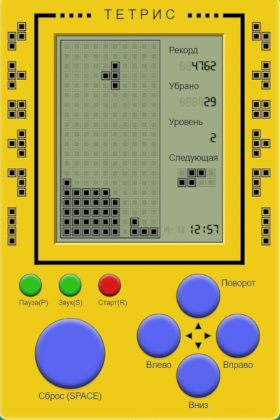

- **`make`**: Compiles the project.
- **`make run`**: Runs the Tetris game.
- **`make dvi`**: Opens the project documentation.

# BrickGame Tetris

Tetris is probably one of the most popular games for the Brickgame console. It's not uncommon for the console itself to be called Tetris. The goal of the game is to score points by building lines of blocks generated by the game. The next block generated by the game starts moving down the board until it reaches the bottom border or collides with another block. The user can rotate the blocks and move them horizontally, trying to make rows. Once a row is filled, it is destroyed, the player scores points, and the blocks above the filled row fall down. The game ends when the next piece stops in the top row.

To formalize the logic of this game, the following variant of a finite state machine can be introduced:

This FSM has the following states:

- Start is the state in which the game waits for the player to press the ready button.
- Spawn is the state the game enters when you create another block and select the next block to spawn.
- Moving is the main game state with user input processing — rotating blocks/moving blocks horizontally.
- Move is the state the game enters after the timer runs out. It moves the current block down one level.
- Attaching is the state the game enters after the current block "touches" the already fallen blocks or the ground. If full rows are created, it is destroyed and the remaining blocks are moved down. If a block is stopped in the top row, the game enters the "game over" state.
- Game over is the end of the game.

You need to implement the BrickGame v1.0 aka Tetris program:

- The program must be developed in C language of the C11 standard using the gcc compiler.
- The program must consist of two parts: a library implementing the logic of the Tetris game, and a terminal interface using the `ncurses` library.
- A finite state machine must be used to formalize the logic of the game.
- The library must have a function that accepts user input and a function that outputs a matrix describing the current state of the playing field whenever it is changed.
- The library code must be placed in the `src/brick_game/tetris` folder.
- The program interface code must be in the `src/gui/cli` folder.
- The program must be built using a Makefile with the standard set of targets for GNU programs: all, install, uninstall, clean, dvi, dist, test, gcov_report. The installation directory can be arbitrary.
- The program must be developed according to the principles of structured programming.
- Follow Google Style when writing code.
- Prepare full coverage of the library with unit tests, using the `check` library (tests must run on Darwin/Ubuntu OS). The coverage of the library with game logic with tests must be at least 80 percent.
- The following mechanics must be present in the game:
  - Rotation of pieces;
  - Horizontal movement of pieces;
  - Acceleration of the piece's fall (when the button is pressed, the piece moves all the way down);
  - Displaying the next piece;
  - Destruction of filled rows;
  - End of the game when the top of the board is reached;
  - All types of pieces shown in the picture below must be included in the game.
- Add support for all buttons provided on the physical console for control:
  - Start game,
  - Pause,
  - End game,
  - Left arrow — move the piece to the left,
  - Right arrow — move piece to the right,
  - Down arrow — piece falls,
  - Up arrow is not used in this game,
  - Action (piece rotation).
- The playing area must be the same size as the console's playing field — ten "pixels" wide and twenty "pixels" high.
- When the figure reaches the lower boundary of the board or touches another figure, it must stop. After that, the next piece, shown in the preview, is generated.
- The library interface must match the description in materials/library-specification.md.
- The UI must support rendering of the playing field and additional information.
- Prepare a diagram in any format describing the FSM used (its states and all possible transitions).

Pieces used:

Add the following mechanics to the game

- Scoring;
- Store maximum score.

This information must be passed and displayed by the user interface in the sidebar. The maximum score must be stored in a file or an embedded DBMS and saved between program runs.

The maximum score must be changed during the game if the user exceeds the current maximum score.

Points are accumulated as follows:

- 1 row is 100 points;
- 2 rows is 300 points;
- 3 rows is 700 points;
- 4 rows is 1500 points.

Add level mechanics to the game. Each time a player earns 600 points, the level increases by 1. Increasing the level increases the speed at which the pieces move. The maximum number of levels is 10.
